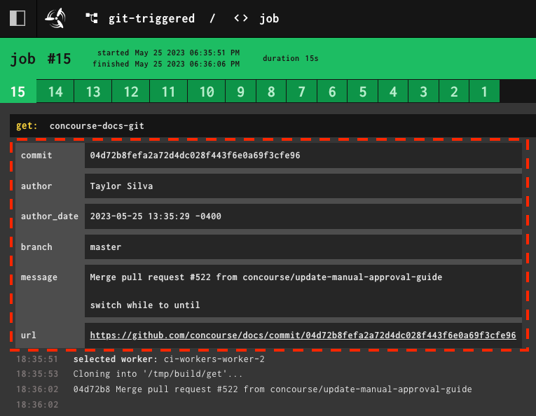

Resource
========

.. automodule:: concoursetools.resource

Concourse Resource Base Class
-----------------------------

.. autoclass:: concoursetools.resource.ConcourseResource
    :members:
    :exclude-members: check_main, in_main, out_main

Step Metadata
-------------

The :meth:`~concoursetools.resource.ConcourseResource.download_version` and :meth:`~concoursetools.resource.ConcourseResource.publish_new_version` methods return "step metadata", which is displayed in the Concourse web UI like so:

    Concourse metadata example from the :concourse:`git-trigger-example.git-trigger-example`. The red outline shows the metadata.

This metadata dictionary should contain string-only key/value pairs. This is enforced by Concourse Tools, which casts both to strings before emitting any JSON. This is not easily overloaded, as the metadata is only ever intended for visual consumption.

.. warning::

    It is okay to leave the metadata dictionary blank, but you **must** return an empty :class:`dict` if so.

.. tip::

    If you want to return metadata which is *not* a string, then consider "stringifying" it in a readable way:

    .. code:: python3

        response_codes = [200, 200, 200, 500]
        metadata = {
            "response_codes": ", ".join(response_codes)
        }

.. warning::

    This metadata is only shown after a step runs successfully, and is omitted if it failed.
